# Драйвер рентгеновской трубки - Обновленная документация

Управление рентгеновской трубкой через REST API с поддержкой COM-порта и расширенными функциями

## 📦 Зависимости
- Conan 1.60+
- CMake 3.12+
- Компилятор с поддержкой C++17
- Boost 1.75+ (Asio, Beast, JSON)
- SQLite3
- spdlog
- OpenCV 4.5+ (только для расширенного анализа изображений)

## 🛠 Установка
```bash
# Установка зависимостей
sudo apt-get install libsqlite3-dev libboost-all-dev

# Сборка проекта
mkdir build && cd build
conan install .. --build=missing -s compiler.cppstd=17
cmake .. -DCMAKE_BUILD_TYPE=Release
cmake --build . --config Release -- -j4
```

## 🚀 Запуск
**Основные команды:**
```bash
# Запуск в интерактивном режиме
sudo ./build/xray_driver --port 8080 --db ./xray_system.db

# Запуск как демон
sudo ./build/xray_driver --daemon --config ./config.json
```

**Параметры командной строки:**
| Параметр       | Описание                          | По умолчанию       |
|----------------|-----------------------------------|-------------------|
| `--port`       | Порт для REST API                 | 8080              |
| `--db`         | Путь к файлу базы данных          | ./xray_system.db  |
| `--daemon`     | Запуск в фоновом режиме           | -                 |
| `--config`     | Путь к конфигурационному файлу    | ./config.json     |
| `--safe-mode`  | Запуск с ограниченной мощностью   | -                 |

## 🌐 REST API v3

### Основные команды управления
```http
POST /api/voltage
Content-Type: application/json
{"voltage": 120}  # 10-150 кВ

POST /api/current
Content-Type: application/json
{"current": 0.25}  # 0.01-0.4 мА

POST /api/exposure
Content-Type: application/json
{"duration_ms": 1000, "mode": "standard"}

POST /api/emergency_stop
```

### Мониторинг и диагностика
```http
GET /api/status  # Текущее состояние системы

GET /api/logs?type=system&limit=10  # Системные логи
GET /api/logs?type=exposure&limit=5 # Логи экспозиций

GET /api/diagnostics  # Диагностика подключения
```

### Управление настройками
```http
GET /api/config  # Все настройки

PUT /api/config
Content-Type: application/json
{"com_port": "COM4", "max_voltage": 140}
```

## 🛠 Конфигурация
Пример `config.json`:
```json
{
  "com_port": "/dev/ttyUSB0",
  "baud_rate": 38400,
  "http_port": 8080,
  "max_voltage": 150,
  "min_voltage": 10,
  "max_current": 0.4,
  "min_current": 0.01,
  "voltage_step_delay_ms": 10,
  "current_check_interval_ms": 100,
  "db_path": "/var/db/xray_system.db",
  "log_path": "/var/log/xray_driver.log"
}
```

## 🧩 Архитектура системы

### Компоненты драйвера


### Протокол взаимодействия с микроконтроллером
Драйвер отправляет команды в текстовом формате:
```
SET_VOLTAGE 120
SET_CURRENT 0.25
START_EXPOSURE 1000
EMERGENCY_STOP
GET_STATUS
```

Микроконтроллер отвечает в формате:
```
VOLTAGE_SET:120
CURRENT_SET:0.25
EXPOSURE_STARTED:1000
EXPOSURE_STOPPED
EMERGENCY_STOP
STATUS:V=120,T=120,I=0.25,E=1,F=1,A=0
```

## 🔌 Поддерживаемое оборудование

### Рентгеновские трубки
- Серия XT-2000 (до 150 кВ)
- Серия XTF-3000 (до 300 кВ)
- Портативные системы NanoRay PX-50

### Системы безопасности
- Модуль RADGuard Pro (автоматическое отключение)
- Датчики перегрева ThermoSafe XR
- Системы вакуумного контроля VacGuard

## ⚙️ Расширенные функции

### Адаптивное управление мощностью
```c++
PowerRegulator regulator(model_path);
float new_power = regulator.adjust_power(
    current_image, 
    current_power,
    body_thickness
);
```

### Пользовательские сценарии
```python
# Пример сценария на Python
import requests

def custom_exposure_sequence():
    config = {"voltage": 80, "current": 0.15}
    requests.post("http://localhost:8080/api/config", json=config)
    
    for i in range(5):
        requests.post("http://localhost:8080/api/exposure", 
                     json={"duration_ms": 200, "mode": "pulse"})
        time.sleep(0.5)
```

## 📊 Система логирования

### Уровни логирования
| Уровень     | Описание                  |
|-------------|---------------------------|
| TRACE       | Детальная отладка         |
| DEBUG       | Отладочная информация     |
| INFO        | Основные события          |
| WARN        | Предупреждения            |
| ERROR       | Ошибки выполнения         |
| CRITICAL    | Критические сбои системы  |

### Ротация логов
- Ежедневная ротация логов
- Автоматическое сжатие старых файлов
- Максимальный размер: 100 МБ на файл
- Хранение: 30 дней

## ⚠️ Безопасность и аварийные протоколы

### Многоуровневая защита
1. Аппаратное отключение при перегреве
2. Программные лимиты напряжения/тока
3. Двойная проверка команд
4. Автоматический cooldown между экспозициями

### Аварийные сценарии



## 🛠 Техническое обслуживание

### Ключевые команды
```bash
# Проверка состояния службы
systemctl status xray_driver

# Просмотр логов в реальном времени
journalctl -fu xray_driver

# Тест подключения к оборудованию
curl http://localhost:8080/api/diagnostics

# Экспорт данных
sqlite3 /var/db/xray_system.db "SELECT * FROM exposure_log" > export.csv
```

### График обслуживания
| Компонент         | Периодичность | Команда проверки               |
|-------------------|---------------|--------------------------------|
| Вакуумная система | Еженедельно   | `GET /api/diagnostics/vacuum`  |
| Охлаждение        | Ежедневно     | `GET /api/diagnostics/cooling` |
| Электроника       | Ежемесячно    | Визуальный осмотр              |
| Программное обес. | При обновлении| Полный тест системы            |


### Критические ситуации
```bash
# Немедленная остановка системы
curl -X POST http://localhost:8080/api/emergency_stop

# Активация безопасного режима
sudo ./xray_driver --safe-mode --max-voltage 50
```

